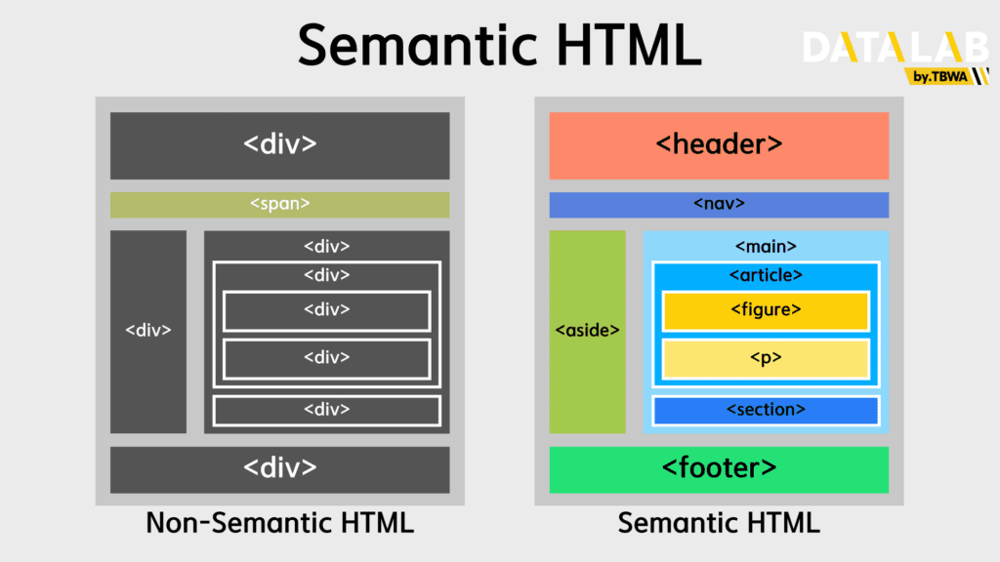

## 표 사용하기
웹 사이트에서 자주 사용하는 형식 중 하나로 표 레이아웃을 이용해 
다수의 데이터들을 적절한 간격 내에서 보여주기 위해 사용

## 기본 테이블 태그
<link rel="stylesheet" href="https://showcases.yalco.kr/html-css/01-06/table.css">
<table>
    <caption>1부터 9까지<br>표로 나열</caption>
    <tr>
      <td>1</td>
      <td>2</td>
      <td>3</td>
    </tr>
    <tr>
      <td>4</td>
      <td>5</td>
      <td>6</td>
    </tr>
    <tr>
      <td>7</td>
      <td>8</td>
      <td>9</td>
    </tr>
  </table> 

1. `<table>` 태그 : 표 전체를 감싸는 역할
2. `<caption>` 태그 : 표의 제목을 넣는 역할
3. `<tr>` 태그 : table row로 배열을 생각할 때 가로줄
4. `<td>` 태그 : table data cell로 배열을 

### 테이블 영역 태그

1. head 영역 : 컬럼명을 의미(db에서는)
2. fotter 영역 : 결산 기록 등을 명시하는 곳


<table>
  <caption>2025년 9월</caption>
  <thead>
    <tr>
      <th scope="col">일</th>
      <th scope="col">월</th>
      <th scope="col">화</th>
      <th scope="col">수</th>
      <th scope="col">목</th>
      <th scope="col">금</th>
      <th scope="col">토</th>
    </tr>
  </thead>
  <tbody>
    <tr scope="row">
      <td></td>
      <td>1</td>
      <td>2</td>
      <td>3</td>
      <td>4</td>
      <td>5</td>
      <td>6</td>
    </tr>
    <tr scope="row">
      <td>7</td>
      <td>8</td>
      <td>9</td>
      <td>10</td>
      <td>11</td>
      <td>12</td>
      <td>13</td>
    </tr>
    <tr scope="row">
      <td>14</td>
      <td>15</td>
      <td>16</td>
      <td>17</td>
      <td>18</td>
      <td>19</td>
      <td>20</td>
    </tr>
    <tr scope="row">
      <td>21</td>
      <td>22</td>
      <td>23</td>
      <td>24</td>
      <td>25</td>
      <td>26</td>
      <td>27</td>
    </tr>
    <tr scope="row">
      <td>28</td>
      <td>29</td>
      <td>30</td>
    </tr>
  </tbody>
</table>

이상의 table을 작성한다고 가정했을 때
tr -> 요일 표시하는 부분 / 한달이 31일이 맥시멈임을 고려했을 때
가로줄 6개가 맥시멈이고 세로줄은 요일별로 7개가 맥시멈<br>
-> `table>caption+(tr*6>td*7)` <br>
전부 emmet을 쓰면 저렇게 되지만 현실적으로 table 태그를 만들고 caption을 만든 후 -> `tr*6>td*7`

### 셀 병합 태그-05_tablespantag

### 열 그룹 태그-05_tablespantag

## 다른 곳으로 링크하기
### `<a>` 태그로 링크 이동하기
`<a href="(연결할 주소)" target=("링크를 열 곳 옵션")>제목</a>`

- href : hypertext reference의 축약어로 접속할 페이지의 주소
- target : 링크를 어떤 형태로 열 것인지에 대한 옵션(새 탭/ 그냥 이동 등)
  - self : 현배 보고 있는 창에서 바로 넘어갈 때
  - _blank : 새 탭 또는 새 창으로 열 때
s
<body>
  <a href="https://www.google.com" target="_blank">새 창에서 구글 열기</a>
</body>

`<a>` : anchor의 축약어

<a href="https://www.google.com" target="_blank">
  
</a>

### id 값으로 원하는 위치로 이동하기-07_idlink

- id : 페이지의 각 요소에 이름이나 일련번호를 붙이는 것. id 값이 중복되서는 안된다

### 태그로 연락처 연결하기

<!DOCTYPE html>
<html lang="ko">
<head>
  <meta charset="UTF-8">
  <meta name="viewport" content="width=device-width, initial-scale=1.0">
  <title>Document</title>
</head>
<body bgcolor="5f5f5f">
  <h1>Contacts</h1>
  웹 사이트 주소 : <a href="https://www.google.com/" target="_blank">google.com</a><br>
  오피스 : 부산광역시 연제구 <br>
  전화 : <a href="tel:010-1234-5678">010-1234-5678</a> <br>
  이메일 : <a href="mailto:a@test.com">a@test.com</a> 
</body>
</html>

`<a>` 태그의 href의 속성값
1. `tel:` 전화번호 - 모바일에서 실행할 경우 통화 화면에 전화번호가 찍힘
2. `mailto:` 이메일 - 모바일에서 실행할 경우 이메일 앱이 열리면서 해당 주소로 이메일 쓰기 가능

`<a>` 태그 정리
1. 특정 url을 통해 원하는 웹페이지로 연결 가능
2. id를 활용해 페이지 내에서 원하는 위치로 이동 가능
3. tel: 을 활용해 통화 기능으로 연결 가능(모바일)
4. mailto: 를 활용해 이메일 작성 기능으로 연결 가능(모바일)

# 사용자로부터 입력 받기
## `<form>` 태그 사용하기
웹페이지의 시작점은 대부분 아이디와 패스워드를 입력하는 것. 사용자로부터 입력을 받아야 한다는 의미. 해당 경우 `<form>` 태그를 사용
### `<form>` 태그의 속성
```html
<!DOCTYPE html>
<html lang="ko">
<head>
  <meta charset="UTF-8">
  <meta name="viewport" content="width=device-width, initial-scale=1.0">
  <title>form 태그의 사용</title>
</head>
<body bgcolor="5f5f5f">
  <form action="../learning_log/Google_2015_logo.svg.webp" method="get">
    <!-- (label+input)*2 -->
    <label for="">이름</label>
    <input id="name" name="my-name" type="text">
    <br><br>
    <label for="">나이</label>
    <input id="age" name="my-age" type="number">
    <br><br>
    <button type="submit">제출</button>
    <button type="reset">초기화</button>
  </form>
</body>
</html>
```
이상의 코드는 이름과 나이를 입력하는 from이 존재한다. 
제출 버튼을 누르면 learning_logs 내에 있는 google logo 이미지가 출력되고 
초기화 버튼을 누르면 input 태그에 입력한 데이터가 초기화 되는 형태로 구현

`<form>`: 사용자로부터 입력을 받기 위한 양식을 작성하는 태그
1. `<form>` 태그
  - action : 이름과 나이를 입력했을 때 그 정보를 가져가서 보여주는 결과 페이지
    - 작성한 방식대로면 google로고 출력
  - method : form 태그에서 작성한 이름과 나이 정보를 조회하는 역할(=getter)
  - autocomplete : default로는 on이지만 이전에 입력한 내용이 모두 저장되어 있는 상태. 이를 끄기 위해선 `autocomplete="off"`로 설정
2. `<input>` 태그 : 키보드로 입력하는 폼에 해당
  - name 속성 자체는 큰 의미보단 서버에서 각 항복을 받을 때 무엇에 대한 값인지 구분하는 이름 정도
3. `<label>` 태그 
  - input 태그와 유기적 연결. 특히 input의 id 값과 label에서의 for가 연결되어 있는데
  input 태그에서 부여한 id 속성값을 label 태그의 for에서 불어옴
  - 이상을 이유로 input의 id와 label의 속성이 일치하면 input 박스를 클릭했을 때 input의 활성화뿐만 아니라 label에 지정된 텍스트를 클릭해도 같은 효과임을 확인 가능
4. `<button>` 태그
  - submit : 사용자가 입력한 결과값을 받는 최종 서버나 특정 페이지 주소로 보내는 제출 용도
  - reset : 입력 내용을 모두 초기화

### `<form>` 태그 안 요소 그룹핑
`<fieldset>` 태그 : 비슷한 정보를 그룹별로 묶을 때 사용하는 form의 하위 태그 중 하나
`<legend>` 태그 : 필수 입력은 아닌 fieldset으로 묶인 소그룹의 제목 작성에 사용

## `<input>` 태그 사용하기

1. placeholder 속성 : 사용자가 안내 메세지 등을 미리 확인하는 역할
2. maxlength 속성 : 텍스트의 최대 글자 수 지정
3. minlength 속성 : 텍스트의 최소 글자 수 지정

type 관련
1. text
2. password : 비밀번호를 입력하는 등의 보안 설정 필요시 사용
3. search : 텍스트를 입력하면 오른쪽에 x 가 뜨고 이를 클릭하면 초기화
4. tel : `<a>` 태그에서는 `tel:`이 존재. input의 type 속성 중 "tel"은 문제 없고 모바일에서 사용하면 숫자 키패드 띄우는 역할

### 숫자 관련
<body>
  <h1>숫자 관련 인풋 타입</h1>
  <form>
    <fieldset>
      <legend>number</legend>
      <label for="numIp">number</label> <br>
      <input id="numIp" type="number" min="0" max="10">
      <br><br>
    </fieldset>
    <fieldset>
      <legend>range</legend>
      <label for="rgIp">range</label> <br>
      <input id="rgIp" type="range" min="0" max="100">
      <br><br>
    </fieldset>
    <fieldset>
      <legend>date</legend>
      <label for="dtIp">date</label> <br>
      <input id="dtIp" type="date" min="2020-01-01" max="2030-12-31">
      <br><br>
    </fieldset>
  </form>
</body>


### 체크 관련 input 태그

<body>
  <h1>체크 관련 인풋 타입</h1>
  <form>
    <fieldset>
    <legend>checkbox</legend>
    <input id="cbIp" type="checkbox" checked>
    <label>유기농</label>
    </fieldset>
    <fieldset>
    <legend>radio</legend>
    <input type="radio" name="fruit" id="f_apple" value="apple" checked>
    <label>사과</label>
    <input type="radio" name="fruit" id="f_grape" value="grape">
    <label>포도</label>
    <input type="radio" name="fruit" id="f_orange" value="orange">
    <label>오렌지</label>
    <legend></legend>
    <input type="radio" name="vege" id="v_carrot" value="carrot" checked>
    <label>당근</label>
    <input type="radio" name="vege" id="v_tomato" value="tomato">
    <label>토마토</label>
    <input type="radio" name="vege" id="v_eggplant" value="eggplant">
    <label>가지</label>
    </fieldset>

    오렌지를 과일 영역에 추가하세요
    당근 토마토 가지를 채소 영역에 추가하세요
    채소 name은 vege로 고정
  </form>
</body>

이상의 코드에서는 radio input의 특징에 주의

1. `checkbox` 타입 : 체크 박스 형태로 사용자 입력을 받는다. 마찬가지로 label의 속성과 id가 일치하면 글자를 클릭해도 체크박스에 설정
2. `checked` 속성 : 따로 값을 지정하지 않는 속성이기에 html 태그의 속성으로 빈도 높음
3. `radio` 타입 : 라디오 버튼이라고 호칭하는 버튼으로 체크

checked 속성을 사용할 경우 radio 중 하나만 체크되어야 한다. 
fruit 파트에서 포도와 오렌지에 checked를 설정했다면 더 최근에 작성 부분이 체크된다. 그렇다면 밑에 있는 당근만 check가 적용되야 할거 같지만 
radio가 허용하는 하위 그룹핑으로 지정하는 `name` 속성이 별개로 구분한다. 상단 과일은 fruit로 하단 채소는 vege로 지정해놔서 두개의 radio가 적용된다.(input 자체에서 그룹핑 할때 자주 사용됨)

가장 비슷하게 확인 가능한 플랫폼은 notion의 다중체크/단일체크 항목

그래서 radio인 이유는 동시에 여러개의 선택지를 선택할 수 없고 반드시 하나만 선택 가능한 점 강조

4. `value` 속성 : 결과를 서버로 넘기는 실제 데이터 값. label에 사과 포도 오렌지 등등을 써놨지만 서버로 전송시 한글 깨짐이 많아 영어로 주로 작성

### 기타 `<input>` 태그
<body>
  <h1>기타 인풋 타입</h1>
  <form>
    <label>file</label><br>
    <input id="fileIp" type="file" accept="image/png, image/jpeg">
    <!-- 여러가지 파릴 한번에 업로드 가능 -->
    <br><br>
    <label>hidden</label><br>
    <input id="hdIp" type="hidden">
  </form>
  <br><br><hr>
  <form>
    <label>email</label><br>
    <input id="emIp" type="email">
    <br><br>
    <button type="submit">제출</button>
  </form>
</body>
<br>


1. file 타입 : 파일을 첨부 할 때 사용
  - accept 속성 : 원하는 유형의 파일만 업로드 가능하게 통제
  - multiple 속성 : 파일 여러 개를 한번에 올릴수 있는 설정
  - defualt는 한번에 파일 하나만 업로드 가능
2. hidden 타입 : 사용자로부터 받은 개인 정보나 코드 연산의 결과가 사용자에게 보이지 않게 하기위해 작성
3. email 타입 : 이메일 형식으로 텍스트를 입력하지 않으면 안내 메세지 출력. 브라우저마다 차이가 있어 아무거나 입력하고 @만 넣거나 @만 있어도 되는 등 정교한 방식은 아닌지라 DB 상에서나 프론트 / 백에 정규식이라는 개념으로 확인

### `<input>` 태그 공통 속성
1. value : placeholer와 달리 값이 전송. 그래서 특정 input에 대해 default 값을 미리 넣어두고 싶을 떄 사용
2. autofocus : 새로고침 했을 때 자동으로 특정 요소가 선택되게 지정하는 속성
3. readonly : 읽기만 가능하고 입력 값은 결과로 저장<br>
ex) 확인하였습니다 같은걸 적고 submit을 누르면 true 값을 적용
4. disabled : 사용자가 값을 입력할 수 없고 결과가 전송되지도 않는다. 주로 품절품 처리시 사용
5. required : 반드시 값을 입력해야하는 input 태그를 의미. submit시 비어있으면 submit 거부

## 기타 태그 사용하기

### `<textarea>` 태그 
- input보다 현저히 긴 텍스트 입력 영역을 지니도록 할 때 사용. 블로그를 예로 들면 제목은 input이고 본문은 textarea 사용. 너비와 줄 수를 각각 cols / rows 속성으로 저장

<body>
  <h1>textarea 태그</h1>
  <label for="message">메세지를 입력하시오</label> <br>
  <input placeholder="제목을 입력하세요">
  <br><br>
  본문
  <textarea id="message" cols="64" row="10">메세지를 입력하시오</textarea>
  <button>발행</button>
</body>

- textarea 태그는 input 태그와 달리 value 속성이 없고 여는 태그와 닫는 태그 사이에 내용을 입력할 경우 default 값으로 textarea 영역 내에 표시. placeholder가 아닌 value 대신 쓰이기에 전송 버튼을 누르면 default 내용이 백엔드로 전송

### 옵션 선택 관련 태그

<body>
  <h1>옵션들을 사용하는 태그</h1>
  <h2>select / option 태그</h2>
  <label for="lang">프로그래밍 언어</label> <br>
  <select>
    <option value>-- 언어 선택 --</option>
    <option value="HTML">HTML</option>
    <option value="CSS">CSS</option>
    <option value="JS">JS</option>
    <option value="TypeScript">TypeScript</option>
  </select>
  <br><br>
  <h2>optgroup</h2>
  <label for="shopping">쇼핑 목록</label>
  <select id="shopping">
      <option value="blank">-- 식재료 선택 --</option>
    <optgroup label="과일">
      <option value="f_apl">사과</option>
      <option value="f_grp">포도</option>
      <option value="f_org">오렌지</option>
    </optgroup>
    <optgroup label="채소">
      <option value="v_crt">당근</option>
      <option value="v_tmt">토마토</option>
      <option value="v_ept">가지</option>
    </optgroup>
    <optgroup label="고기">
      <option value="m_bef">소고기</option>
      <option value="m_prk">돼지고기</option>
      <option value="m_chn">닭고기</option>
    </optgroup>
  </select>
  <br><br>
  <h2>datalist 태그</h2>
  <label for="job">현재 직업</label>
  <input id="job" list="jobs">
  <datalist id="jobs">
    <option value="학생">
    <option value="디자이너">
    <option value="퍼블리셔">
    <option value="개발자">
  </datalist>
</body>
<br><br>


이상의 예시 코드에서 select 코드의 자손 태그로 option 사용. option 태그에는 value 속성을 지정해 전송 결과값을 넣어야 결과값이 백엔드와 연동. 그래서 -- 언어선택 -- 은 value가 공백

default로 선택한 값을 남기려면 `<option value="HTML">HTML</option>` 식으로 작성 가능

optgroup 태그 : option group의 축약어로 카테고리 명에 해당 -- 언어 선택 -- 괴는 달리 과일 /채소 / 육류는 선택 자체가 불가능

dataList 태그 : inpu과 dataList를 연결해 추천 답안을 미리 제시하는 방식

# `<div>` vs. `<span>`  태그 - 아무 기능 없음

<body>
  <h1>아무 것도 하지않는 두 태그</h1>
  <span>span 태그 1</span>
  <span>span 태그 2</span>
  <span>span 태그 3</span>
  <span>span 태그 4</span>
  <span>span 태그 5</span>
  <br><br>
  <div>div 태그 1</div>
  <div>div 태그 2</div>
  <div>div 태그 3</div>
  <div>div 태그 4</div>
  <div>div 태그 5</div>
</body>
<br>


두 태그는 둘 다 아무런 역할을 하지 않고 태그 내부에 있는 내용만을 보여줄 떄 사용

성격의 차이는
1. `<span>` 태그 : 컨텐츠가 차지하는 영역만큼 범위 보유 - 컨텐츠 영역만 차지하는 것을 인라인(inline)
2. `<div>` 태그 :컨텐츠가 들어간 줄 전체를 전부다 차지 - 컨텐츠가 차지하는 row 자체를 블록(block)

으로 용어를 지정 <br>
그러나 문제는 css에서는 경계를 입맛대로 바꿀 수 있어 혼란 발생

# 시멘틱 태그(Sementic Tags)
- 의미가 있는 태그 라는 뜻으로 HTML5에서 이 시멘틱 태그를 적극적으로 사용. div 태그와 유사하나 이름을 마음대로 붙일 수 있다는 장점

# 장점
1. 웹 접근성 개선
- 시멘틱 태그로 작성한 문서는 컴퓨터 화면을 음성으로 읽어주는 스크린 리더페이지 사용시 정보를 쉽게 찾을 수 있다
2. 검색 엔진 최적화(SEO)
- 검색 엔진 사용시 특정 키워드를 사용하면 각 사이트의 내용을 간략히 보여주는데 검색 엔진 자체 알고리즘이 시멘틱 태그를 읽어서 검색 상단 노출 하는 경우 존재
3. 유지 보수 및 가독성
- 전부 div로 작성하면 추후 유지 보수에 결국 div 내부의 내용을 눈으로 읽어가며 수정해야하는 반면 시멘틱 태그 사용시 태그 이름만 보고 원하는 영역을 수정하기 용이

# 종류
1. `<header>`
- 페이지 구획의 최상단에서 제목 역할을 하는 요소들을 배치할 때 사용. 왼쪽 상단의 home로 가는 이미지나 우측 상단의 sign up / in 등아 존재
2. `<nav>`
-  링크로 이동하는 요소들을 포함 사이트맵을 통해 들어갈 수 있는 구역들을 표시할 때 사용. 내비게이션의 축약어
3. `<footer>`
- header의 반대로 페이지 최하단의 회사 연락처 / 사업자 정보 / 저작권 문구를 작성하는 공간. nav 역할도 수행 가능
4. `<main>`
- 페이지의 가장 중요한 부분으로 주요 내용이 들어가는 영역. 페이지마다 하나만 존재해야 하며 main 태그가 하나의 html에 여러개 존재 할 수 있음
5. `<aside>`
- main 태그와 연관된 컨텐츠 포함(=사이드바)
6. `<section>`
- 페이지의 컨텐츠를 주제나 성격에 따라 일정 단위 구획으로 나누는데 사용. 더 작은 단위로 찢을 떄는 div 사용
7. `<article>`
- 페이지 내에서 여러 번 재사용되는 페이지로 독립적이고 다른 페이지에 사용 컨텐츠에 사용. 주로 페이지 내의 카드 요소, 기사 / 블로그 포스트 / 댓글 등지
8. `<figure>`
- 이미지를 넣는 img 태그와 캡션을 넣는 figcaption 태그를 묶는데 사용

